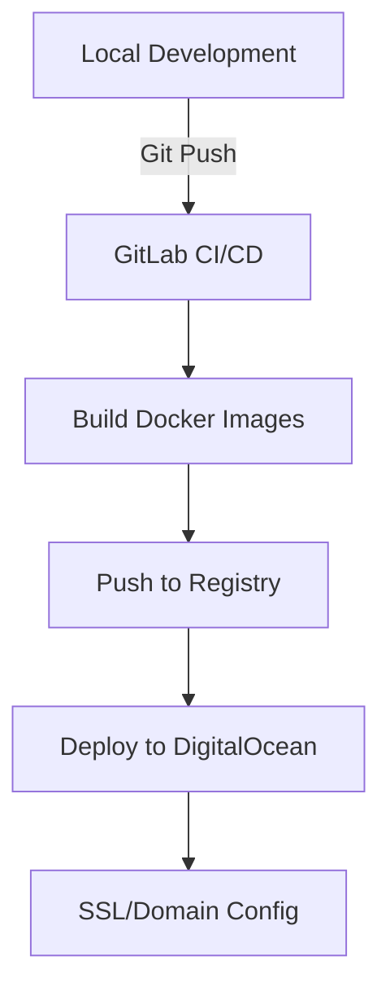

Historical Research and Web Development, not two subjects that are often or easily combined. But I believe that well-designed web applications have immense potential for presenting historical research to a broader public for education and for improvement of that research through the input of the public.

My own story in digital history is documented in the blog. As to my background in web development (aside from previous experiences with wix and wordpress) this started in 2021, when I joined [TechLabs Berlin](https://www.techlabs.org/location/berlin). As part of 6-month programme I learnt the basics of web development in javascript. I joined a team and was proud to work on a project which mapped public toilets across Berlin, the project was called Peedom. While quite different from historical transport networks, this experience taught me fundamental lessons about making data accessible and useful to the public. Working in a team, writing code that real people would use, I began to see possibilities for sharing my academic research in new ways.

## Why Build a Web Application for Historical Research?

As I delve deeper into my PhD research on Berlin's Cold War public transportation system, I want to keep track of my progress in a space that is accessible for all.

A web application offers possibilities for exploring the data that would not be possible in traditional academic publishing. Beyond static maps and charts, I want to create interactive visualisations offer ai-powered chatbots for exploring data and start a conversation, where anyone contribute their own insights and experiences on Berlin's transport history.

## The Technical Architecture

When I started planning the application, I quickly realized that I wanted to use this both as a important part of my historical research and also as a challenge that lets me improve my programming knowledge and experiences. The application should be complex, but easy to use, and example of what a modern-academic web application can be.

### Frontend Development Tools

My first major decision involved choosing the right tools for building the user interface. While I had experience with React from previous projects, the landscape had evolved considerably. After researching current best practices, I chose [Next.js](https://nextjs.org/) as my foundation. Next.js extends React's capabilities in ways that proved perfect for a history project - it handles complex routing automatically and makes it easier to build fast, search-engine friendly websites.

Here's a simple example of how Next.js simplifies development:

```javascript
// Traditional React requires manual setup for routing
import { BrowserRouter, Route } from 'react-router-dom';

// Next.js handles routing automatically through file structure
// pages/stations/[id].js automatically creates routes for each station
export default function Station({ stationData }) {
  return <StationVisualization data={stationData} />;
}
```

The next challenge was ensuring data accuracy - crucial when working with historical information. This led me to [**Typescript**](https://www.typescriptlang.org/), a more structured version of JavaScript that helps prevent errors before they happen. While learning TypeScript felt like learning a new language at first, it proved invaluable for handling complex historical data:

```typescript
/// Without TypeScript, errors might only appear when running the code
interface TransportStation {
  name: string;
  yearOpened: number;
  lines: string[];
  coordinates: {
    lat: number;
    lng: number;
  };
}

// TypeScript catches errors before they happen
const invalidStation: TransportStation = {
  name: "Alexanderplatz",
  yearOpened: "1913", // Error: Type 'string' is not assignable to type 'number'
  coordinates: {
    lat: 52.5219
    // Error: Missing required property 'lng'
  }
};
```

For the visual aspects of the application, I needed a styling solution that would be both flexible and maintainable. After experimenting with component libraries like Material UI, I discovered [Tailwind CSS](https://tailwindcss.com/). While its utility-first approach was unfamiliar (almost like writing CSS in HTML), it proved remarkably efficient for creating consistent, responsive designs:

```html
<!-- Creating consistent, responsive design elements -->
<div class="grid grid-cols-1 md:grid-cols-2 lg:grid-cols-3 gap-4">
  <StationCard class="p-4 bg-white shadow-lg rounded-lg hover:shadow-xl transition-shadow" />
</div>
```

This approach meant I could quickly adjust layouts and styling while maintaining consistency across the application.

## Backend Infrastructure

The backend of the application presented unique challenges that are particularly relevant to historical research. Historical data is often complex and interrelated - a single station might have different names over time, belong to different administrative districts as borders shifted, and have varying connections to other stations. Beyond just serving web pages, the backend needs to handle these complex temporal relationships while ensuring the information remains accurate and accessible. This led me to build the backend infrastructure using several complementary technologies that could handle both the scale and complexity of historical data.

At the foundation is [Node.js](https://nodejs.org/), which I was already familiar with from previous projects and provides a robust ecosystem of tools for handling web requests and processing data. Using Express, a framework for Node.js, I could create clear, secure APIs for accessing the project's data:

```javascript
// Setting up a secure API endpoint
const express = require('express');
const app = express();

app.get('/api/stations/:year', async (req, res) => {
  try {
    // Validate year parameter - ensuring we only return data for our research period
    const year = parseInt(req.params.year);
    if (isNaN(year) || year < 1945 || year > 1989) {
      return res.status(400).json({ error: 'Invalid year' });
    }
    
    // Fetch stations data from database
    const stations = await getStationsForYear(year);
    res.json(stations);
  } catch (error) {
    console.error('Error fetching stations:', error);
    res.status(500).json({ error: 'Internal server error' });
  }
});
```

Perhaps the most exciting technical decision was choosing Neo4j as the database. Traditional databases struggle to represent the complex web of relationships that historians often work with - in our case, how do you efficiently model thousands of connections that change over time while preserving historical context? Neo4j's graph structure fits with my needs as it offers flexibility and descriptiveness. In this use case, instead of forcing historical data into rigid tables, we can model it as interconnected nodes and relationships that evolve over time.

For the transport network, this means stations are nodes that can maintain multiple temporal attributes (names, administrative districts, types of service), while relationships between stations can capture how connections changed year by year. This makes it possible to ask sophisticated historical questions about network evolution that would be cumbersome or impossible with traditional databases. For example, we can easily find stations that were cut off by the Berlin Wall:

```cypher
// Find all stations that gained or lost connections in 1961
MATCH (s:Station)
WHERE exists((s)-[:CONNECTED_IN_YEAR {year: 1960}]-())
  XOR exists((s)-[:CONNECTED_IN_YEAR {year: 1961}]-())
RETURN s.name, s.district
```

The graph database approach also makes it easier to integrate additional historical context as the project grows. We can add nodes for historical events, demographic data, or administrative changes, creating a rich web of interconnected historical information. I will discuss the data model in more detail in another article, but this flexibility in modeling historical relationships has already proven invaluable for understanding how Berlin's transport network evolved within its broader historical context.

## From Development to Deployment: The Journey to the Web

Getting all this working on my local computer was one challenge; making it accessible to the world was another entirely. Thanks to a well-timed workshop at Humboldt University's IZ Digitalität, I learned about continuous integration and deployment (CI/CD) - essentially, automating the process of getting code from my computer to the internet safely and efficiently.

I also decided to utilise the credits I had recieved through the GitHub Education programme. I chose DigitalOcean for hosting and Namecheap for the domain name, not just because they were free through the programme, but because they're widely used services with excellent documentation - crucial when you're learning deployment for the first time.

The deployment process I built looks like this:



Each step serves a specific purpose. When I push code to GitLab, it automatically:

1. Checks for errors
2. Creates Docker containers (think of them as perfectly packed boxes containing everything the application needs to run)
3. Sends these containers to DigitalOcean
4. Updates the live website

This automation means I can focus on improving the application and adding new features without worrying about the technical details of deployment every time I make a change.

## The Role of AI in Development

Throughout this project, I've used LLM (Large Language Model) assistants like Claude to help understand technical concepts and debug issues. However, I've learned to use these tools thoughtfully. While  LLMs can suggest solutions and explain concepts, it's crucial to verify against official documentation and current best practices. Web development moves quickly - what was best practice six months ago might be outdated today.

## Looking Forward: The Future of the Project

While the current website is up-and-running it is still a work in progress. I have many ideas for future extensions, plans include:

1. **Ineratctive Timeline Visualization**: Using D3.js to create dynamic visualizations of how Berlin's transport network evolved year by year.

    ```javascript
    // Conceptual code for timeline visualization
    import { Timeline } from 'd3-timeline';

    const BerlinTransportTimeline = () => {
    useEffect(() => {
        const timeline = new Timeline()
        .data(transportData)
        .band("years", 1945, 1989)
        .on("select", year => showNetworkState(year));
    }, []);
    };
    ```

2. **Community Contributions:** Building features that let users contribute their own insights on Berlin's public transport history.

3. **Data Integration:** Connecting the transport network data with other historical datasets about Berlin, creating a richer picture of how the city evolved.

Throughout the process, I have found that technical skills and historical research while seperate domains are complementary tools for making history more accessible and engaging. The challenge now is continuing to bridge these worlds, finding new ways to bring historical research to life through technology.
